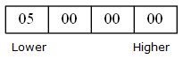
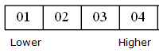
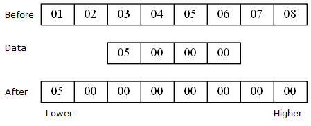
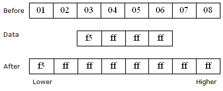

# 数据

## 指令中数据的长度限制

### 概念

CMS 的一些指令中会有字面量数据，如：

```
load %1, 5, cms#int32
```

在传统的汇编语言/字节码中，指令中的字面量会限制其长度，这样可以方便指令的读取和数据的处理。

因为 CMS 对整型数据的处理都是使用函数调用实现的，因此 CMS 对指令中数据的长度没有特殊要求。

CMS 允许 CMS 的处理程序对 指令中字面量数据的长度 进行限制。

CMS 的数据分为可存放于指令中的 **短数据** 与 只能存放于数据段的 **长数据** 。
短数据 是 不大于 限制长度 的数据，长数据 是 长度超过 限制长度。
这两个术语仅在描述具体的实现（CVM等）和一些特定的场所中使用。
CMS 没有规定短数据和长数据的界限，具体的实现可以根据需要进行设计。

### CVM 中的处理方式

在 CVM 中，指令中的限制长度为 32 位。

短数据 是 不大于 32位 的数据。包括但不限于：
- cms#boolean 类型数据。
- cms#int8, cms#int16, cms#int32, cms#uint8, cms#uint16, cms#uint32 等机器无关的不超过32位的定长数据。

长数据 是 32位 限制长度。包括但不限于：
- cms#string 字符串数据。
- cms#int64, cms#uint64 等机器无关的超过32位定长数据。

机器相关的数据具有未知的长度，根据具体的编译时信息来确定。包括但不限于：

- cms#int, cms#uint, cms#float, cms#double 等不定长数据。
- cms#pointer C 指针数据。

## 数据的加载方式

### 数据寄存器模式

加载到寄存器中时，静态数据寄存器和动态数据寄存器的加载方式有所区别。

加载到静态数据寄存器中时，会将数据拷贝到寄存器空间；加载到动态数据寄存器中时，会将数据的指针引入其中。

具体的加载方式由实现详细设定。

### 字节序

在不同的硬件或软件环境下，字节序（一段数据存储的字节的顺序）不同。

CMS 规定了两种加载方式，按值加载和按序加载。

按值加载是指，按照所运行的环境，加载出正确的值。

一个按小端序存储的 int32 整型 5 ，其内存结构如下：



按值加载会产生如上结果。

按值加载要求，源数据能够正确地表示值。因为 CMS 可能会被编译为二进制文件，加载这个文件时所读取的字节顺序可能会与实际的运行环境有所出入。 CMS 要求按值加载时所加载的数据，存储时必须能够正确地表示值。

按序加载要求，加载数据时按照给定的顺序加载。

如
```
.array #1, 0x01 0x02 0x03 0x04
```
加载这个数据时，第一个数据存储在最初的目标地址，其后数据所存储的地址依次累加。

按序加载所加载的数据的字节序是机器无关的（位序仍然与机器有关），其加载结果如下：



### 值数据的加载

指令中能存储的数据长度是确定的，数据段中的值数据在存储时也可能以较小的字节存储。因此，可能会出现源数据与目标空间长度不一致的情况。

CMS 要求，加载数据后，目标的数据实际含义的值应与源数据含义值一致。

假设指令中最大存储 4字节 的数据，而指定类型的长度为 8字节 。同时，指定机器字节序为小端序。（如下结果在不同环境下是不同的。）

加载无符号整型 5 时：



加载符号整型 -11 时：


