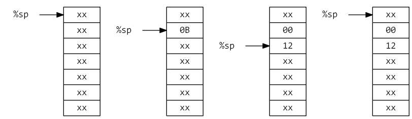

# 栈

栈 (Stack) 是 CMS 运行期的一种特殊结构。

因为栈是长度可变的结构，栈的重用能够有效利用空间。

由于 CMS 中存在着长度与其类型有关的静态数据寄存器，当函数调用产生临时数据后，如果都设置静态数据寄存器，空间很难得到有效地利用。


```
.type int8
    .size 1

.type int16
    .size 2

.type int32
    .size 4

; add_int8_int8   ( int8,  int8) -> int8
; add_int8_int16  ( int8, int16) -> int16
; add_int16_int32 (int16, int32) -> int32

.func main
    .static %1, int8
    .static %2, int8
    .static %3, int16
    .static %4, int32

    .static %5, int32

    load %1, 5, int8
    load %2, 6, int8
    load %3, 7, int16
    load %4, 8, int32

    ;; %5 = (((%1 + %2) + %3) + %4)
    ...

    ret
```

仅使用静态数据寄存器（保留 %1 ~ %5 的数据）：

```
    .static %6, int8
    .static %7, int16

    call %6, add_int8_int8, %1, %2
    call %7, add_int8_int16, %6, %3
    call %5, add_int16_int32, %7, %4
```

如上示例可以发现，仅使用静态数据寄存器，会使得 %6 和 %7 所占据的空间无法有效利用（因为长度不一致）。

如果使用栈的情况，代码如下表示：（%sp!n 表示读取完成后，%sp 递减 n（实际的地址改变顺序未定义））

```
    callp add_int8_int8, %1, %2
    callp add_int8_int16, %sp(int8)!, %3
    call %5, add_int16_int32, %sp(int16)!, %4
```

当指令中同时存在两个 %sp(xxx)! 时，按照**从右到左**的顺序读取参数。

运行过程如下（图示为小端序，向下增长型）：



%sp 有如下使用方式：

- %sp 使用 %sp 保存的指针。
- %sp(n|T) 将 %sp 指向的地址视为一个长度为 n 字节/保存了 T 类型数据的空间。
- %sp(n|T)! 传参时视为空间，结束读取后 %sp 递减 空间长度。
- %sp\[x\]\(n|T\) 以 %sp+x 的地址为起始，视为一个 n 字节长度/T 类型 空间。

一个call指令的参数由一组 %sp(xxx)! 组成时，这个 call 指令其实就相当于以栈的方式传递参数。当这个 call 指令是 callp 时，这条指令的效果就类似于传统的栈调用指令。

参数由栈传递的 call 指令是 calls 指令，
结果由栈传递的 call 指令是 callp 指令，
参数和结果都由栈传递的指令是 callsp 指令。

与传统栈指令类似，有着将数据放入栈中的 push 指令和将栈中数据提取出来的 pop 指令。

通过编译器，可以生成如下标准的栈形式代码：

```
    push %4
    push %3
    push %2
    push %1
    callsp add_int8_int8
    callsp add_int8_int16
    calls  %5, add_int16_int32
```
